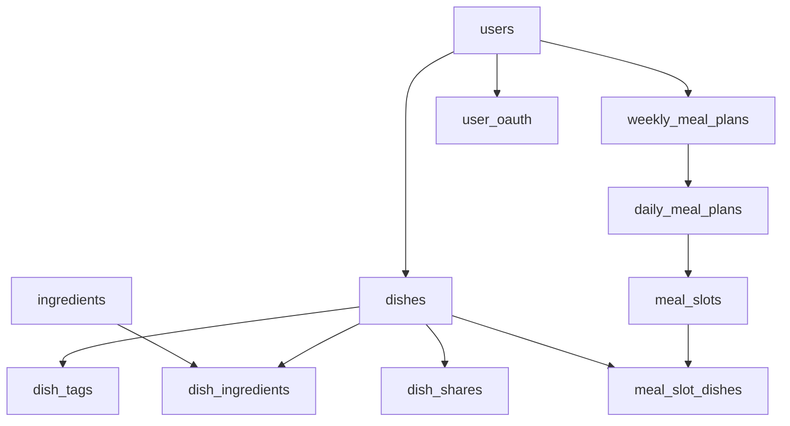

# Weekly Meal Planner Database Design

## Overview

This document outlines the database schema for a weekly meal planner application that supports user-owned recipes, recipe sharing, discovery features, and persistent meal planning dashboards.

## Core Features

- **User Management**: Support for email and OAuth (Google/GitHub) authentication
- **Recipe Management**: User-owned recipes with privacy controls
- **Recipe Sharing**: Share specific recipes with other users
- **Recipe Discovery**: Public recipes for community discovery
- **Meal Planning**: Persistent weekly meal planning dashboard
- **Ingredient Management**: Normalized ingredient system

## Database Schema

### Authentication & Users

#### `users`

Stores user account information with support for multiple authentication methods.

| Column                | Type     | Constraints                | Description                            |
| --------------------- | -------- | -------------------------- | -------------------------------------- |
| `user_id`             | INTEGER  | PRIMARY KEY, AUTOINCREMENT | Unique user identifier                 |
| `username`            | TEXT     | UNIQUE, NULLABLE           | Username (optional for OAuth users)    |
| `email`               | TEXT     | UNIQUE, NOT NULL           | User's email address                   |
| `password_hash`       | TEXT     | NULLABLE                   | Hashed password (null for OAuth users) |
| `display_name`        | TEXT     | NULLABLE                   | User's display name                    |
| `profile_public`      | BOOLEAN  | DEFAULT FALSE              | Whether user profile is public         |
| `registration_method` | TEXT     | NOT NULL                   | enum: 'email', 'google', 'github'      |
| `created_at`          | DATETIME | DEFAULT CURRENT_TIMESTAMP  | Account creation timestamp             |
| `updated_at`          | DATETIME | DEFAULT CURRENT_TIMESTAMP  | Last update timestamp                  |

#### `user_oauth`

Stores OAuth provider information for external authentication.

| Column             | Type     | Constraints                  | Description                    |
| ------------------ | -------- | ---------------------------- | ------------------------------ |
| `oauth_id`         | INTEGER  | PRIMARY KEY, AUTOINCREMENT   | Unique OAuth record identifier |
| `user_id`          | INTEGER  | FOREIGN KEY → users(user_id) | Reference to user account      |
| `provider`         | TEXT     | NOT NULL                     | enum: 'google', 'github'       |
| `provider_user_id` | TEXT     | NOT NULL                     | OAuth provider's user ID       |
| `access_token`     | TEXT     | NULLABLE                     | Encrypted access token         |
| `refresh_token`    | TEXT     | NULLABLE                     | Encrypted refresh token        |
| `expires_at`       | DATETIME | NULLABLE                     | Token expiration time          |
| `created_at`       | DATETIME | DEFAULT CURRENT_TIMESTAMP    | OAuth link creation time       |
| `updated_at`       | DATETIME | DEFAULT CURRENT_TIMESTAMP    | Last token update time         |

**Unique Constraint**: `(provider, provider_user_id)` - Prevents duplicate OAuth accounts

### Recipe Management

#### `dishes`

Stores user-owned recipes with visibility and sharing controls.

| Column        | Type     | Constraints                  | Description                                     |
| ------------- | -------- | ---------------------------- | ----------------------------------------------- |
| `dish_id`     | INTEGER  | PRIMARY KEY, AUTOINCREMENT   | Unique dish identifier                          |
| `owner_id`    | INTEGER  | FOREIGN KEY → users(user_id) | Recipe owner                                    |
| `name`        | TEXT     | NOT NULL                     | Recipe name                                     |
| `description` | TEXT     | NULLABLE                     | Recipe description                              |
| `calories`    | INTEGER  | CHECK (calories >= 0)        | Estimated calories per serving                  |
| `meal`        | TEXT     | NOT NULL                     | enum: 'breakfast', 'lunch', 'dinner', 'dessert' |
| `special`     | BOOLEAN  | DEFAULT FALSE                | Whether recipe is marked as special             |
| `url`         | TEXT     | NULLABLE                     | External recipe URL                             |
| `visibility`  | TEXT     | DEFAULT 'private'            | enum: 'private', 'shared', 'public'             |
| `prep_time`   | INTEGER  | NULLABLE                     | Preparation time in minutes                     |
| `cook_time`   | INTEGER  | NULLABLE                     | Cooking time in minutes                         |
| `created_at`  | DATETIME | DEFAULT CURRENT_TIMESTAMP    | Recipe creation time                            |
| `updated_at`  | DATETIME | DEFAULT CURRENT_TIMESTAMP    | Last recipe update                              |

**Visibility Levels**:

- `private`: Only owner can access
- `shared`: Owner + specifically shared users can access
- `public`: All users can discover and use

#### `dish_shares`

Manages recipe sharing between users.

| Column        | Type     | Constraints                   | Description                    |
| ------------- | -------- | ----------------------------- | ------------------------------ |
| `share_id`    | INTEGER  | PRIMARY KEY, AUTOINCREMENT    | Unique share record identifier |
| `dish_id`     | INTEGER  | FOREIGN KEY → dishes(dish_id) | Recipe being shared            |
| `shared_by`   | INTEGER  | FOREIGN KEY → users(user_id)  | User sharing the recipe        |
| `shared_with` | INTEGER  | FOREIGN KEY → users(user_id)  | User receiving the recipe      |
| `shared_date` | DATETIME | DEFAULT CURRENT_TIMESTAMP     | When recipe was shared         |
| `can_reshare` | BOOLEAN  | DEFAULT FALSE                 | Whether recipient can reshare  |

**Unique Constraint**: `(dish_id, shared_with)` - Prevents duplicate shares

#### `dish_tags`

Assigns multiple tags to recipes for categorization.

| Column    | Type    | Constraints                   | Description                                                   |
| --------- | ------- | ----------------------------- | ------------------------------------------------------------- |
| `dish_id` | INTEGER | FOREIGN KEY → dishes(dish_id) | Recipe reference                                              |
| `tag`     | TEXT    | NOT NULL                      | enum: 'drink', 'dessert', 'vegetable', 'meat', 'carbohydrate' |

**Primary Key**: `(dish_id, tag)` - Composite key allows multiple tags per dish

### Ingredient System

#### `ingredients`

Master list of all available ingredients.

| Column          | Type     | Constraints                | Description                                                            |
| --------------- | -------- | -------------------------- | ---------------------------------------------------------------------- |
| `ingredient_id` | INTEGER  | PRIMARY KEY, AUTOINCREMENT | Unique ingredient identifier                                           |
| `name`          | TEXT     | UNIQUE, NOT NULL           | Ingredient name                                                        |
| `unit`          | TEXT     | NULLABLE                   | Default unit of measurement                                            |
| `category`      | TEXT     | NULLABLE                   | enum: 'vegetable', 'meat', 'dairy', 'grain', 'spice', 'fruit', 'other' |
| `created_at`    | DATETIME | DEFAULT CURRENT_TIMESTAMP  | Ingredient creation time                                               |

#### `dish_ingredients`

Links recipes to their ingredients with quantities (replaces hashmap approach).

| Column          | Type    | Constraints                              | Description          |
| --------------- | ------- | ---------------------------------------- | -------------------- |
| `dish_id`       | INTEGER | FOREIGN KEY → dishes(dish_id)            | Recipe reference     |
| `ingredient_id` | INTEGER | FOREIGN KEY → ingredients(ingredient_id) | Ingredient reference |
| `quantity`      | REAL    | NOT NULL, CHECK (quantity > 0)           | Amount needed        |

**Primary Key**: `(dish_id, ingredient_id)` - One quantity per ingredient per recipe

**Example**: Recipe hashmap `{potato: 2, salt: 6 gram}` becomes:

```sql
-- ingredients table
(1, 'potato', 'piece', 'vegetable')
(2, 'salt', 'gram', 'spice')

-- dish_ingredients table
(recipe_id, 1, 2.0)    -- 2 pieces of potato
(recipe_id, 2, 6.0)    -- 6 grams of salt
```

### Meal Planning System

#### `weekly_meal_plans`

Each user has exactly one persistent meal planning dashboard.

| Column       | Type     | Constraints                          | Description             |
| ------------ | -------- | ------------------------------------ | ----------------------- |
| `plan_id`    | INTEGER  | PRIMARY KEY, AUTOINCREMENT           | Unique plan identifier  |
| `user_id`    | INTEGER  | UNIQUE, FOREIGN KEY → users(user_id) | Plan owner (one-to-one) |
| `created_at` | DATETIME | DEFAULT CURRENT_TIMESTAMP            | Plan creation time      |
| `updated_at` | DATETIME | DEFAULT CURRENT_TIMESTAMP            | Last plan update        |

**Design Decision**: One-to-one relationship ensures each user has a single, persistent meal planning dashboard rather than historical weekly plans.

#### `daily_meal_plans`

Seven daily plans per user (Monday through Sunday).

| Column           | Type    | Constraints                              | Description                     |
| ---------------- | ------- | ---------------------------------------- | ------------------------------- |
| `daily_plan_id`  | INTEGER | PRIMARY KEY, AUTOINCREMENT               | Unique daily plan identifier    |
| `weekly_plan_id` | INTEGER | FOREIGN KEY → weekly_meal_plans(plan_id) | Parent weekly plan              |
| `day_of_week`    | INTEGER | CHECK (1 <= day_of_week <= 7)            | Day number (1=Monday, 7=Sunday) |

**Unique Constraint**: `(weekly_plan_id, day_of_week)` - Exactly one plan per day per user

#### `meal_slots`

Flexible meal time slots within each day.

| Column          | Type    | Constraints                                   | Description                                       |
| --------------- | ------- | --------------------------------------------- | ------------------------------------------------- |
| `slot_id`       | INTEGER | PRIMARY KEY, AUTOINCREMENT                    | Unique slot identifier                            |
| `daily_plan_id` | INTEGER | FOREIGN KEY → daily_meal_plans(daily_plan_id) | Parent daily plan                                 |
| `meal_type`     | TEXT    | NOT NULL                                      | enum: 'breakfast', 'lunch', 'dinner', 'dessert'   |
| `slot_order`    | INTEGER | DEFAULT 1                                     | Order within meal type (allows multiple desserts) |

**Unique Constraint**: `(daily_plan_id, meal_type, slot_order)` - Supports multiple slots of same meal type

#### `meal_slot_dishes`

Links recipes to specific meal slots with serving sizes.

| Column         | Type    | Constraints                       | Description                    |
| -------------- | ------- | --------------------------------- | ------------------------------ |
| `slot_id`      | INTEGER | FOREIGN KEY → meal_slots(slot_id) | Meal slot reference            |
| `dish_id`      | INTEGER | FOREIGN KEY → dishes(dish_id)     | Recipe reference               |
| `serving_size` | REAL    | DEFAULT 1.0                       | Number of servings (e.g., 1.5) |

**Primary Key**: `(slot_id, dish_id)` - Multiple recipes per meal slot

## Key Design Decisions

### 1. User Registration & Authentication

- Supports both email/password and OAuth authentication
- `password_hash` is nullable for OAuth-only users
- `username` is optional to accommodate OAuth providers that don't provide usernames

### 2. Recipe Ownership & Sharing

- Every recipe belongs to a specific user (no global recipe database)
- Three-tier visibility system: private, shared, public
- Granular sharing controls with reshare permissions
- Public recipes enable community discovery while maintaining ownership

### 3. Ingredient Management

- Normalized approach instead of JSON/hashmap storage
- Enables complex queries (find all recipes with specific ingredients)
- Supports ingredient substitution and nutritional analysis
- Prevents ingredient name inconsistencies

### 4. Meal Planning Architecture

- Persistent dashboard model (not historical weekly plans)
- Flexible meal slot system supports varying meal patterns
- Unlimited recipes per meal slot
- Serving size tracking for portion control

### 5. Database Relationships



## Performance Considerations

### Indexes

- `idx_dishes_owner`: Fast user recipe lookups
- `idx_dishes_meal_type`: Filter recipes by meal type
- `idx_dishes_visibility`: Public recipe discovery queries
- `idx_user_oauth_provider`: OAuth login performance
- `idx_dish_shares_shared_with`: Find recipes shared with user
- `idx_meal_slots_daily_plan`: Meal plan construction queries

### Query Patterns

- **User's recipes**: `SELECT * FROM dishes WHERE owner_id = ?`
- **Recipe discovery**: `SELECT * FROM dishes WHERE visibility = 'public'`
- **Available recipes**: Combines owned + shared + public recipes
- **Weekly meal plan**: Complex JOIN across meal planning tables
- **Ingredient search**: `JOIN dish_ingredients ON ingredients`

## Scalability Notes

- **Horizontal scaling**: User-centric design supports sharding by `user_id`
- **Caching**: Recipe data and meal plans are good candidates for caching
- **Search optimization**: Full-text search on recipe names/descriptions
- **Image storage**: Recipe images should be stored in object storage (S3, etc.)

## Future Enhancements

- **Recipe ratings**: Add user rating system for shared/public recipes
- **Nutritional data**: Extend ingredients table with nutritional information
- **Shopping lists**: Generate shopping lists from meal plans
- **Recipe versioning**: Track recipe modifications over time
- **Social features**: Recipe comments, user following, recipe collections
